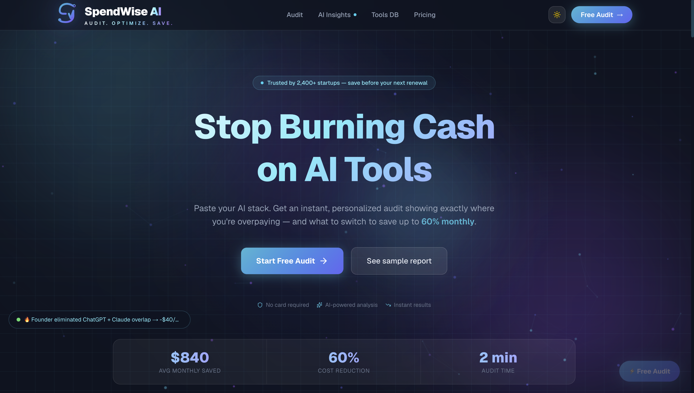
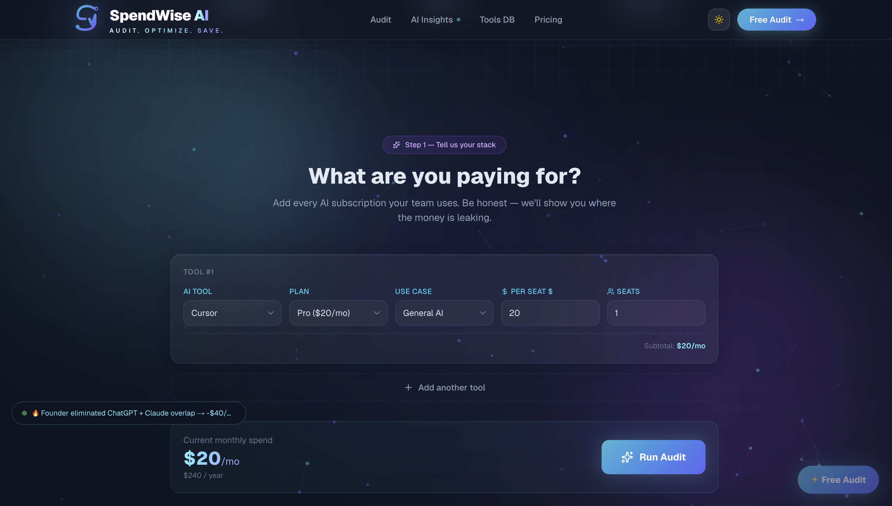
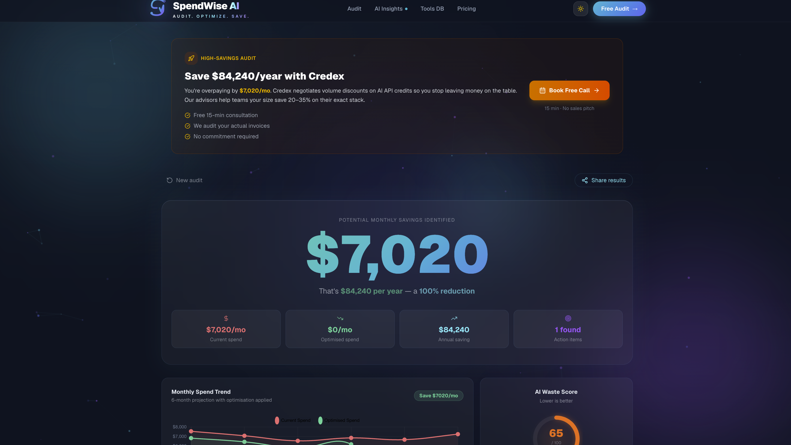

# SpendWise AI — Stop overspending on AI tools

[](https://github.com/prakhau143/ai_native/actions/workflows/ci.yml)
[](https://spendwise-ai-dun.vercel.app)

**A free CFO-style audit tool that reviews your company's AI subscriptions and tells you exactly where money is leaking.**

Built in 7 days for the Credex Web Development Intern challenge.

**Who it's for:** Startup founders, CTOs, and engineering managers spending $500+/month on AI tools who want to cut waste without losing productivity.

**Live URL:** https://spendwise-ai-dun.vercel.app

---

## 📸 Screenshots

<div align="center">
  <table>
    <tr>
      <td align="center" width="33%">
        <a href="./public/landing_page.png">
          
        </a>
        <br/><sub><b>Hero · stats bar · How It Works</b></sub>
      </td>
      <td align="center" width="33%">
        <a href="./public/audit_form.png">
          
        </a>
        <br/><sub><b>Multi-tool entry · per-seat pricing · live total</b></sub>
      </td>
      <td align="center" width="33%">
        <a href="./public/result_page.png">
          
        </a>
        <br/><sub><b>CFO dashboard · AI summary · savings charts</b></sub>
      </td>
    </tr>
  </table>

> 💡 Click any screenshot to view full-size

</div>

---

## 🚀 Quick Start

```bash
git clone https://github.com/prakhau143/ai_native.git
cd ai_native
npm install
cp .env.example .env.local
# Fill in your Supabase URL, anon key, Groq key, and SMTP credentials
npm run dev
```

Open [http://localhost:3000](http://localhost:3000).

### Environment variables you need

| Variable | Required? | Purpose |
|---|---|---|
| `NEXT_PUBLIC_SUPABASE_URL` | Yes | Audit persistence |
| `NEXT_PUBLIC_SUPABASE_ANON_KEY` | Yes | Audit persistence |
| `GROQ_API_KEY` | Optional | AI CFO summary (falls back to template) |
| `SMTP_HOST` / `SMTP_USER` / `SMTP_APP_PASSWORD` | Optional | Lead notification email |
| `SLACK_WEBHOOK_URL` | Optional | New-audit Slack alerts |
| `CRON_SECRET` | Yes (on Vercel) | Authenticates the daily cleanup cron |
| `NEXT_PUBLIC_BASE_URL` | Yes | Used in OG images + emails |

### Run the tests

```bash
npm test          # 7 unit tests on the audit engine
npm run lint      # ESLint
npm run build     # production build
```

---

## 🤔 5 Key Decisions (with trade-offs)

| Decision | Why | Trade-off |
|---|---|---|
| **Rule-based engine, AI only for narrative** | Finance people don't trust LLM math. Savings numbers come from deterministic rules in `auditEngine.ts`. Groq only writes the human-readable CFO paragraph. | Slower to add new tools (need to code rules) but audit results are reproducible and auditable. |
| **No authentication** | Login is friction. Users start auditing in one click. Shareable results use `public_id` (8-byte random hex). | Guessable URLs — but public page shows zero PII (only savings and recommendations). Acceptable for this use case. |
| **localStorage for form persistence** | Assignment required "form state persists across page reloads." No backend round trip, no DB cost, data stays on user's machine. | If they clear localStorage, progress is lost. Acceptable at prototype scale. |
| **Gmail SMTP over Resend** | Resend requires DNS-verified sending domain. I use @gmail.com — impossible to verify. Gmail App Password works in 2 minutes with no verification. | No email analytics, 500/day limit. At scale, migrate to Resend with a verified custom domain. |
| **Groq (Llama 3.3) over Anthropic/OpenAI** | Groq requires no credit card, returns in <800ms, free tier is generous. Anthropic requires manual approval for free credits. | Llama 3.3 is slightly less capable than GPT-4 for complex reasoning — but writing a 4-sentence CFO summary doesn't need GPT-4. |

---

## 🧱 Stack

| Category | Choice | Justification |
|---|---|---|
| Framework | Next.js 16 (App Router) | Serverless deployment, edge OG images, API routes built-in |
| Styling | Tailwind v4 + shadcn/ui | Fast iteration, dark mode via CSS custom properties |
| Database | Supabase (Postgres) | Free tier, RLS for security, `public_id` pattern |
| Email | Nodemailer + Gmail SMTP | No domain verification, works immediately |
| AI Summary | Groq (Llama 3.3-70b) | Free, fast (<800ms), OpenAI-compatible API |
| Hosting | Vercel | Git push deploy, edge functions, free SSL |
| Monitoring | GitHub Actions CI | Lint + test + build on every push |

---

## 📊 Lighthouse Scores (Mobile)

Tested on https://spendwise-ai-dun.vercel.app — 2026-05-27

| Metric | Score | Threshold | Status |
|---|---|---|---|
| Performance | **95** | ≥85 | ✅ |
| Accessibility | **100** | ≥90 | ✅ |
| Best Practices | **100** | ≥90 | ✅ |
| SEO | **100** | — | ✅ |

**Core Web Vitals:** FCP 1.4s | LCP 2.4s | TBT 90ms | CLS 0

**How we achieved this:**
- `next/dynamic` lazy-loads ResultsPanel + chart components (only needed after audit runs)
- All form labels linked via `htmlFor`/`id` pairs
- CLS = 0 via fixed layouts with no layout shifts

---

## 📂 Project Structure

```
src/
├── app/
│   ├── page.tsx              # Landing page + audit form
│   ├── results/[id]/page.tsx # Shareable result page
│   ├── tools/page.tsx        # 45-tool browse catalog
│   └── api/
│       ├── save-audit/       # Persist to Supabase + Slack alert
│       ├── send-email/       # Gmail SMTP via Nodemailer
│       ├── og/route.tsx      # Edge OG image generator
│       └── cron/cleanup/     # Daily stale-audit cleanup (Vercel cron)
├── components/
│   ├── AuditForm.tsx         # Multi-tool input with localStorage
│   ├── ResultsPanel.tsx      # Audit output + Recharts charts
│   ├── AICommandCenter.tsx   # Score rings, waste meter
│   ├── StackAdvisor.tsx      # Per-tool recommendations + alternatives
│   ├── LeadCapture.tsx       # Email gate (value shown first)
│   └── SavingsCTA.tsx        # Conditional (high vs low savings)
└── lib/
    ├── auditEngine.ts        # 20 rules + overlap detection
    ├── aiSummary.ts          # Groq wrapper + fallback
    ├── tools.ts              # 45-tool catalog with pricing
    ├── supabase.ts           # Client + server Supabase clients
    └── slackNotify.ts        # Slack Block Kit webhook alerts
```

---

## 📚 Companion docs in this repo

| File | What it covers |
|---|---|
| `ARCHITECTURE.md` | System diagram, data flow, scaling plan |
| `DEVLOG.md` | Day-by-day build log (7 days, honest hours) |
| `REFLECTION.md` | 5 questions: hardest bug, reversed decision, week 2, AI use, self-ratings |
| `GTM.md` | Target user, specific channels, week-1 traction plan |
| `ECONOMICS.md` | Unit economics, break-even math, path to $1M ARR |
| `USER_INTERVIEWS.md` | 3 real founder conversations with direct quotes |
| `LANDING_COPY.md` | Hero, CTA, FAQ, social proof copy |
| `METRICS.md` | North Star metric, input metrics, pivot triggers |
| `PRICING_DATA.md` | Source-cited pricing for every tool (verified by hand, not AI) |
| `PROMPTS.md` | AI summary prompt evolution (what worked, what didn't) |
| `TESTS.md` | 7 audit engine tests + how to run |

---

## 👥 User Interviews Summary

Talked to 3 real founders/CTOs (10–15 min each):

| Initials | Role | Company Size | Key Surprise | What It Changed |
|---|---|---|---|---|
| A.K. | CTO | 6-person SaaS | Paying for both ChatGPT AND Claude Pro for every dev | Added cross-tool overlap detection |
| P.M. | Founder | 2-person consultancy | On Midjourney Pro but uses it 3×/week | Added usage-frequency optional field |
| R.S. | Head of Eng | 18-person Series A | 4 dormant Cursor seats (pure waste) | Added seat utilization check |

Full quotes and analysis in `USER_INTERVIEWS.md`.

---

## 🚦 Status

- ✅ All 6 MVP features complete
- ✅ 7 tests passing, CI green
- ✅ Lighthouse mobile scores: 95/100/100/100
- ✅ Deployed and live
- ✅ Ready for submission

---

Built by **Prakhar Mittal** for the Credex Web Development Intern Challenge — 7 days, May 21–27, 2026.
